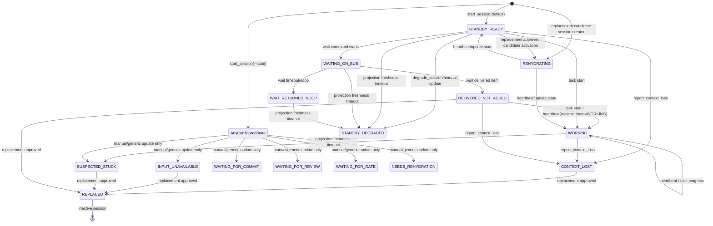

# Runtime State Current State

Date: 2026-06-08

Scope: this document describes the runtime state model that is currently implemented in the repository. It intentionally separates observed implementation behavior from recommended behavior. The target model is documented separately in [runtime-state-target-state.md](runtime-state-target-state.md).

## Executive Summary

The current runtime model has a useful but incomplete state vocabulary. `AgentRuntimeState` is persisted on `agent_sessions.runtime_state`, mirrored into `agent_health.runtime_state`, and projected into UI summaries. State changes are written through several independent paths:

- `AgentDirectory.start_session`, `switch_active_session`, `update_session_state`, `heartbeat_session`, `replace_session`, `replace_with_session`, and `degrade_session`.
- CLI wait flow, which marks agents as `WAITING_ON_BUS`, `WAIT_RETURNED_NOOP`, or `DELIVERED_NOT_ACKED`.
- Task start flow, which marks an assigned agent `WORKING`.
- Replacement flow, which marks the old session `REPLACED` and the candidate session `REHYDRATING`.
- Read-time projection freshness, which derives stale-looking states for some old heartbeats without persisting those derived states.

The current implementation does not yet form a complete explicit state machine. Some states are enum-only or manual-only, several transitions are possible through generic `update_session_state`, and heartbeat expiry is partially implemented as projection logic instead of a lifecycle transition. This is the source of status ambiguity such as old temporary simulation agents still appearing operational.

Current `runtime_state` is currently an activity/health hint, not an authoritative lifecycle state. UI, scheduling, identity cleanup, and gate relevance are therefore unsafe if they treat `runtime_state` as the only source of truth.

## Current State Diagram

This diagram reflects observed code paths, not all possible manual writes. Transitions labeled as projection freshness are read-time derivations, not persisted lifecycle transitions.

## Current Data Model

`AgentSession` carries the durable lifecycle fields:

- `session_id`
- `agent_id`
- `run_id`
- `active`
- `session_epoch`
- `session_role`
- `runtime_state`
- `fencing_token_hash`
- `max_concurrent_tasks`
- `accepts_new_work`
- `started_at`
- `last_seen_at`
- `ended_at`
- `replaced_by_session_id`
- `quarantined`

`AgentHealth` is derived from the current runtime state when state-writing methods run:

- `health_score` comes from `_HEALTH_BY_STATE`.
- `stale` is true only for `DELIVERED_NOT_ACKED`, `SUSPECTED_STUCK`, `INPUT_UNAVAILABLE`, `CONTEXT_LOST`, and `NEEDS_REHYDRATION`.
- `input_available` is false only for `INPUT_UNAVAILABLE`.
- `context_valid` is false for `CONTEXT_LOST` and `NEEDS_REHYDRATION`.

Projection freshness is separate from persisted health. It currently derives only these read-time states after `AGENT_BUS_SESSION_FRESHNESS_SECONDS`, default 300 seconds:

- `STANDBY_READY` -> `STANDBY_DEGRADED`
- `WAITING_ON_BUS` -> `STANDBY_DEGRADED`
- `WAIT_RETURNED_NOOP` -> `STANDBY_DEGRADED`
- `WORKING` -> `SUSPECTED_STUCK`

## Current Transition Writers

| Writer | Current behavior |
| --- | --- |
| `start_session` | Creates a session with `STANDBY_READY` by default, or a caller-provided state. Sets `active`, `started_at`, `last_seen_at`, and health. |
| `switch_active_session` | Deactivates other sessions for the agent, reactivates the selected session, updates `last_seen_at`, preserves its existing runtime state, and writes health. |
| `update_session_state` | Generic writer. Sets any `AgentRuntimeState`, refreshes `last_seen_at`, and recomputes health. This bypasses explicit transition validation. |
| `heartbeat_session` | Valid only for active sessions without `ended_at`. Optionally sets a caller-provided runtime state, refreshes `last_seen_at`, and recomputes health. |
| `report_context_loss` | Convenience wrapper for `update_session_state(..., CONTEXT_LOST)`. |
| `replace_session` | Same identity replacement. Marks old session inactive, `REPLACED`, ended, and activates another session for the same identity. |
| `replace_with_session` | Cross-session replacement path. Marks old session inactive and `REPLACED`; activates candidate session as `REHYDRATING` by default. |
| `degrade_session` | Convenience wrapper for `update_session_state(..., STANDBY_DEGRADED)`. |
| CLI wait | Best-effort updates active session to `WAITING_ON_BUS`, then `WAIT_RETURNED_NOOP` or `DELIVERED_NOT_ACKED`. |
| Task start | If task becomes `WORKING`, active assignee session is set to `WORKING`. |
| Projection freshness | Read-only derivation; does not persist state, end session, revoke inbox, or retire identity. |

## State Reference

### WAITING_ON_BUS

Chinese definition: Agent 正在等待新的可见 inbox item 或任务输入。

English definition: The agent is actively waiting on the runtime inbox for work or messages.

State manifestation:

- Health score: 0.95.
- `stale`: false when persisted through `AgentDirectory`.
- Projection can derive `STANDBY_DEGRADED` if `last_seen_at` exceeds the freshness threshold.
- Usually written by CLI wait start.

Possible incoming states:

- `STANDBY_READY`
- `WAIT_RETURNED_NOOP`
- `DELIVERED_NOT_ACKED`
- Any state through generic `update_session_state` or heartbeat override

Possible outgoing states:

- `WAIT_RETURNED_NOOP`
- `DELIVERED_NOT_ACKED`
- `STANDBY_DEGRADED` as read-time projection freshness
- Any state through generic `update_session_state` or heartbeat override

Required operations between transitions:

- Enter: run wait flow or call generic state update.
- Exit to noop: wait returns no item.
- Exit to delivered: wait returns an item.
- Exit to degraded: no heartbeat within freshness threshold; currently projection-only.

### WAIT_RETURNED_NOOP

Chinese definition: Agent 最近一次 wait 调用没有拿到可处理 item。

English definition: The latest wait operation returned no item.

State manifestation:

- Health score: 0.90.
- `stale`: false when persisted.
- Projection can derive `STANDBY_DEGRADED` after heartbeat freshness expiry.
- It records an idle wait result but is not automatically normalized back to `STANDBY_READY`.

Possible incoming states:

- `WAITING_ON_BUS`
- Any state through generic update or heartbeat override

Possible outgoing states:

- `WAITING_ON_BUS`
- `STANDBY_DEGRADED` as read-time projection freshness
- Any state through generic update or heartbeat override

Required operations between transitions:

- Enter: wait returns noop.
- Exit: run wait again, heartbeat with a new state, or manually update session.

### DELIVERED_NOT_ACKED

Chinese definition: Runtime 已向 Agent 交付 inbox item，但尚未观察到 ack。

English definition: An inbox item was delivered to the agent but has not yet been acknowledged.

State manifestation:

- Health score: 0.70.
- `stale`: true.
- Replacement recommendation treats this as a trigger named `delivered_not_acked`.
- Current code does not show a durable ack operation that automatically moves the session to a ready or working state.

Possible incoming states:

- `WAITING_ON_BUS`
- Any state through generic update or heartbeat override

Possible outgoing states:

- `WORKING`
- `CONTEXT_LOST`
- `REPLACED`
- Any state through generic update or heartbeat override

Required operations between transitions:

- Enter: wait returns an item.
- Exit to working: task start or heartbeat reports `WORKING`.
- Exit to replaced: replacement approved after delivery/ack failure is used as replacement evidence.

### WORKING

Chinese definition: Agent 正在执行已分配任务。

English definition: The agent is actively working on an assigned task.

State manifestation:

- Health score: 0.95.
- `stale`: false when persisted.
- Projection freshness can derive `SUSPECTED_STUCK` after heartbeat expiry.
- Task start flow writes this state for the assignee.

Possible incoming states:

- `STANDBY_READY`
- `DELIVERED_NOT_ACKED`
- `WAITING_ON_BUS`
- `REHYDRATING`
- Any state through heartbeat override or generic update

Possible outgoing states:

- `SUSPECTED_STUCK` as read-time projection freshness
- `CONTEXT_LOST`
- `INPUT_UNAVAILABLE`
- `WAITING_FOR_COMMIT`
- `WAITING_FOR_REVIEW`
- `WAITING_FOR_GATE`
- `STANDBY_READY`
- `REPLACED`

Required operations between transitions:

- Enter: task start or heartbeat/generic state update.
- Exit by progress completion: currently there is no guaranteed automatic session transition when task completes.
- Exit by freshness: missing heartbeat in projection.
- Exit by replacement: replacement approval.

### WAITING_FOR_COMMIT

Chinese definition: Agent 完成了可提交工作，等待提交或 controller 采纳。

English definition: The agent has work ready and is waiting for commit or controller acceptance.

State manifestation:

- Enum exists.
- No dedicated writer or projection freshness rule was found in the inspected implementation.
- Health score is not defined in `_HEALTH_BY_STATE`; using this state through `_health_for` would currently fail unless the map is extended.

Possible incoming states:

- Intended: `WORKING`
- Current: only if caller manually uses generic state update, but health map coverage is missing.

Possible outgoing states:

- Intended: `WAITING_FOR_REVIEW`, `WAITING_FOR_GATE`, `STANDBY_READY`, `WORKING`, `REPLACED`
- Current: undefined by explicit code path.

Required operations between transitions:

- Intended enter: completion claim or commit preparation.
- Current requirement: health scoring and explicit writer need implementation before safe use.

### WAITING_FOR_REVIEW

Chinese definition: Agent 的输出正在等待 review。

English definition: The agent output is waiting for review.

State manifestation:

- Enum exists.
- No dedicated writer or freshness rule was found.
- Health score is not defined in `_HEALTH_BY_STATE`; using this state through `_health_for` would currently fail unless the map is extended.

Possible incoming states:

- Intended: `WAITING_FOR_COMMIT`, `WORKING`
- Current: no safe explicit path without health map extension.

Possible outgoing states:

- Intended: `WAITING_FOR_GATE`, `WORKING`, `STANDBY_READY`, `REPLACED`
- Current: undefined by explicit code path.

Required operations between transitions:

- Intended enter: review request created.
- Intended exit: review approved, changes requested, or replacement approved.

### WAITING_FOR_GATE

Chinese definition: Agent 已到达需要 gate 决策的阶段。

English definition: The agent is blocked on an explicit gate decision.

State manifestation:

- Enum exists.
- No dedicated writer or freshness rule was found.
- Health score is not defined in `_HEALTH_BY_STATE`; using this state through `_health_for` would currently fail unless the map is extended.

Possible incoming states:

- Intended: `WAITING_FOR_REVIEW`, `WAITING_FOR_COMMIT`, `WORKING`
- Current: no safe explicit path without health map extension.

Possible outgoing states:

- Intended: `STANDBY_READY`, `WORKING`, `REPLACED`, `CONTEXT_LOST`
- Current: undefined by explicit code path.

Required operations between transitions:

- Intended enter: gate opened for the agent/task.
- Intended exit: gate approved, rejected, escalated, or replacement approved.

### SUSPECTED_STUCK

Chinese definition: Agent 被认为可能卡住，需要 controller/QA 介入。

English definition: The agent is suspected to be stuck and needs controller or QA intervention.

State manifestation:

- Health score: 0.30.
- `stale`: true.
- Replacement recommendation uses this as a `manual_controller_mark` trigger.
- Projection freshness can derive this from old `WORKING` sessions, but the derivation is read-only.

Possible incoming states:

- `WORKING` through projection freshness
- Any state through generic update

Possible outgoing states:

- `REPLACED`
- `WORKING`
- `STANDBY_READY`
- `CONTEXT_LOST`

Required operations between transitions:

- Enter: controller/manual mark or read-time freshness derivation from `WORKING`.
- Exit: successful heartbeat/manual recovery, replacement approval, or context loss report.

### INPUT_UNAVAILABLE

Chinese definition: Agent 的输入通道不可用，无法继续接收或处理指令。

English definition: The agent input channel is unavailable.

State manifestation:

- Health score: 0.25.
- `stale`: true.
- `input_available`: false.
- Replacement recommendation treats it as `input_unavailable`.

Possible incoming states:

- Any state through generic update.

Possible outgoing states:

- `REPLACED`
- `STANDBY_READY`
- `WAITING_ON_BUS`

Required operations between transitions:

- Enter: manual/generic update when input channel failure is detected.
- Exit: repair input channel and heartbeat/update, or approve replacement.

### CONTEXT_LOST

Chinese definition: Agent 上下文不可用或不可信，需要重建上下文或替换。

English definition: The agent context is unavailable or untrusted and must be rebuilt or replaced.

State manifestation:

- Health score: 0.35.
- `stale`: true.
- `context_valid`: false.
- Replacement recommendation treats it as `context_suspect`.
- Written by `report_context_loss`.

Possible incoming states:

- Any active state through `report_context_loss`.

Possible outgoing states:

- `NEEDS_REHYDRATION`
- `REHYDRATING`
- `REPLACED`
- `STANDBY_READY`

Required operations between transitions:

- Enter: context loss report.
- Exit to replacement: replacement approval.
- Exit to ready: manual recovery or heartbeat override; no strict transition validation currently.

### NEEDS_REHYDRATION

Chinese definition: Agent 需要接收 rehydration packet 才能继续。

English definition: The agent requires a rehydration packet before it can continue.

State manifestation:

- Health score: 0.45.
- `stale`: true.
- `context_valid`: false.
- Enum and health semantics exist, but no direct writer was found in the inspected paths.

Possible incoming states:

- Intended: `CONTEXT_LOST`, `SUSPECTED_STUCK`, `INPUT_UNAVAILABLE`
- Current: only generic update.

Possible outgoing states:

- `REHYDRATING`
- `REPLACED`

Required operations between transitions:

- Intended enter: controller determines the agent should be repaired instead of replaced.
- Intended exit: create/deliver rehydration context packet or approve replacement.

### REHYDRATING

Chinese definition: Agent 正在根据 rehydration packet 重建工作上下文。

English definition: The agent is rebuilding its working context from a rehydration packet.

State manifestation:

- Health score: 0.65.
- `stale`: false in persisted health.
- Replacement approval activates candidate sessions with this state.
- Current projection freshness does not derive stale state from old `REHYDRATING`, so an abandoned rehydration can remain apparently non-stale.

Possible incoming states:

- Replacement candidate session creation.
- Replacement approval through `replace_with_session`.
- Generic update.

Possible outgoing states:

- `WORKING`
- `STANDBY_READY`
- `CONTEXT_LOST`
- `REPLACED`

Required operations between transitions:

- Enter: replacement coordinator creates or activates candidate session.
- Exit to working: heartbeat/update after rehydration starts task.
- Exit to ready: heartbeat/update after context is restored but no work is active.
- Exit to failed context: context loss report or generic update.

### STANDBY_READY

Chinese definition: Agent 在线、可接新工作、当前无明确阻塞。

English definition: The agent is online, healthy, and ready to accept work.

State manifestation:

- Health score: 1.00.
- `stale`: false when persisted.
- Default state for new sessions.
- Projection freshness can derive `STANDBY_DEGRADED` after heartbeat timeout.

Possible incoming states:

- Session start.
- Heartbeat/generic update from most non-terminal states.
- Replacement recovery path after rehydration.

Possible outgoing states:

- `WAITING_ON_BUS`
- `WORKING`
- `CONTEXT_LOST`
- `INPUT_UNAVAILABLE`
- `STANDBY_DEGRADED`
- `REPLACED`

Required operations between transitions:

- Enter: start session, heartbeat, manual recovery.
- Exit to wait: wait command.
- Exit to working: task start.
- Exit to degraded: freshness timeout or manual degrade.

### STANDBY_DEGRADED

Chinese definition: Agent 没有明确工作进展，且健康/心跳已降级。

English definition: The agent is idle or standby but degraded due to missing heartbeat or manual degradation.

State manifestation:

- Health score: 0.55.
- Persisted `degrade_session` writes this state and health.
- Projection freshness can derive it from `STANDBY_READY`, `WAITING_ON_BUS`, and `WAIT_RETURNED_NOOP`.
- Persisted health from `_health_for` does not mark `STANDBY_DEGRADED` as stale; projection-derived health does mark stale true.

Possible incoming states:

- `STANDBY_READY`
- `WAITING_ON_BUS`
- `WAIT_RETURNED_NOOP`
- Any state through generic update

Possible outgoing states:

- `STANDBY_READY`
- `WAITING_ON_BUS`
- `WORKING`
- `REPLACED`

Required operations between transitions:

- Enter: manual degrade or missing heartbeat projection.
- Exit: heartbeat/manual recovery or replacement approval.

### REPLACED

Chinese definition: Session 已被另一个 session 接管，不再是有效执行者。

English definition: The session has been replaced by another session and is no longer an active executor.

State manifestation:

- Health score: 0.00.
- `active`: false.
- `ended_at`: set.
- `replaced_by_session_id`: set.
- Fencing may also mark the old session role as replaced.

Possible incoming states:

- Any old session selected for replacement.

Possible outgoing states:

- None intended. Current code can reactivate sessions via generic activation paths, but this should be treated as unsafe unless explicitly designed.

Required operations between transitions:

- Enter: replacement approval or same-identity replacement.
- Exit: no ordinary transition. A new session should be started instead.

## Current Gaps

1. There is no single transition table that validates legal incoming and outgoing states.
2. Generic `update_session_state` can write arbitrary states without checking whether the transition is legal.
3. `WAITING_FOR_COMMIT`, `WAITING_FOR_REVIEW`, and `WAITING_FOR_GATE` exist in the enum but are not covered by health scoring, making them unsafe with `_health_for` until `_HEALTH_BY_STATE` is extended.
4. `NEEDS_REHYDRATION` exists in health semantics but has no clear dedicated writer in the inspected paths.
5. Heartbeat expiry is read-time projection, not a durable session lifecycle event.
6. Freshness derivation omits `DELIVERED_NOT_ACKED`, `WAITING_FOR_COMMIT`, `WAITING_FOR_REVIEW`, `WAITING_FOR_GATE`, `REHYDRATING`, `INPUT_UNAVAILABLE`, `CONTEXT_LOST`, and `NEEDS_REHYDRATION`.
7. `STANDBY_DEGRADED` has inconsistent stale semantics: manual degradation writes health with `stale=false`, while projection-derived degradation marks health stale true.
8. Acking an inbox item does not clearly transition `DELIVERED_NOT_ACKED` to another runtime state.
9. Task completion, task failure, gate approval, and review completion do not clearly restore session readiness.
10. Replacement and rehydration can leave old task/inbox responsibility in projections unless separate relevance policy filters them.
11. Role-based relevance treats `controller` and `qa` roles as always system-relevant, which keeps temporary identities visible even when stale.

## Review Questions

1. Should `WAITING_FOR_COMMIT`, `WAITING_FOR_REVIEW`, and `WAITING_FOR_GATE` remain agent runtime states, or should they be task/gate states only?
2. Should heartbeat expiry be persisted as a `SESSION_STALE_EVENT`, or remain read-time projection only?
3. Should a session have a terminal state other than `REPLACED`, such as `RETIRED` or `EXPIRED`, or should that be represented by `active=false` plus `ended_at`?
4. Should queued inbox keep an offline/replaced agent visible, or should inbox be reassigned/revoked when session authority expires?
5. Should controller/QA visibility be based on canonical identity allowlists rather than role strings?

## Wave10 Migration Appendix

Wave10 moves the implemented model toward the target contract without rewriting historical events:

- Contract fields are introduced before policy consumers. Identity lifecycle, session role/end reason, presence, workload, relevance, visibility, and conditions are explicit axes rather than meanings inferred from `runtime_state`.
- Runtime freshness and presence are projection-owned. Missing heartbeat can produce stale/offline presence, degraded or stuck activity, and explanatory conditions without persisting those derived projections as durable truth.
- Inbox and gate relevance are projection-owned. Invalid owner authority, expired delivery leases, missing evidence, unavailable explicit gate owners, superseded gates, and historical gates are derived from durable inbox/gate/task/run/artifact facts.
- Frontend views must consume explicit backend visibility fields. They should not decide archive eligibility, stale ownership, inbox lease expiry, gate relevance, or action-item eligibility from role strings, raw session health, or local UI conditionals.
