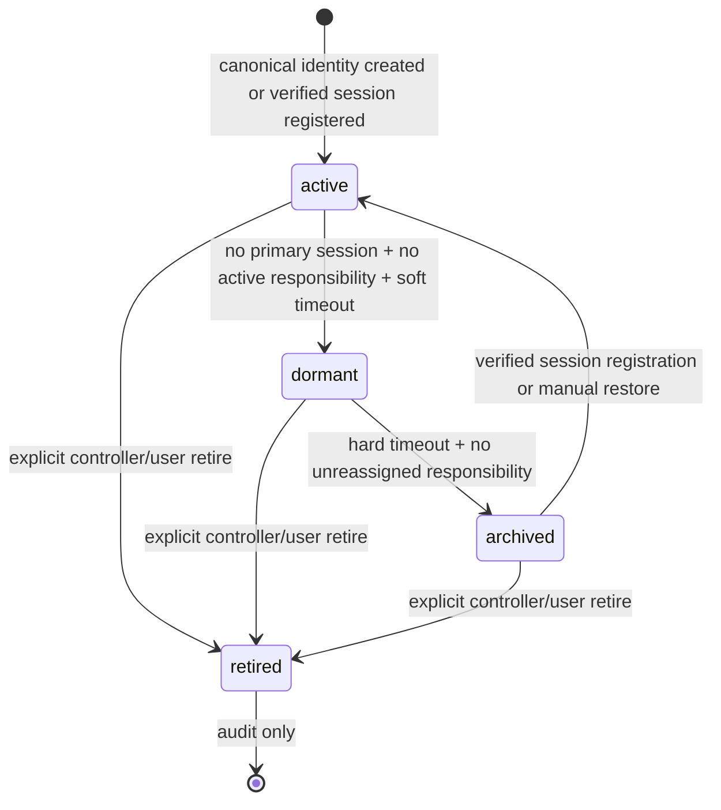
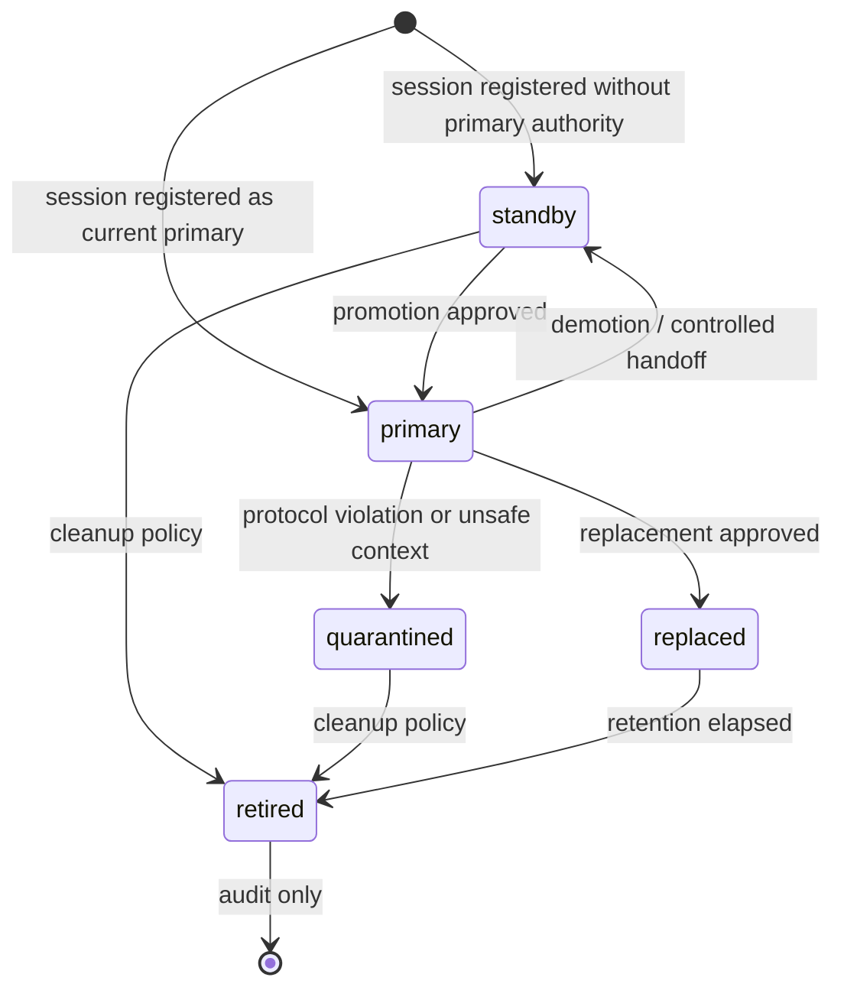
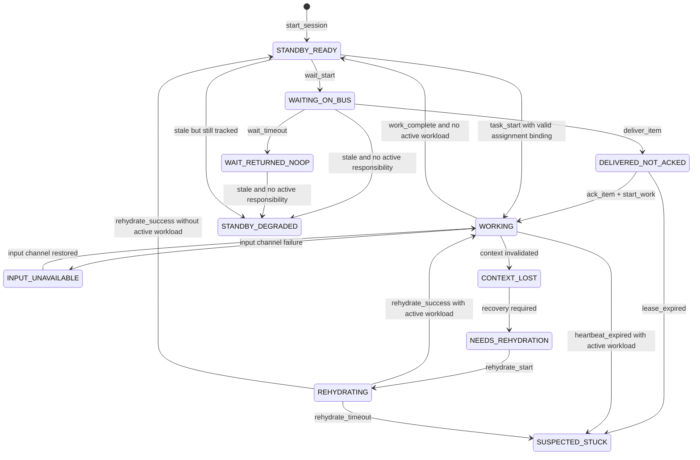
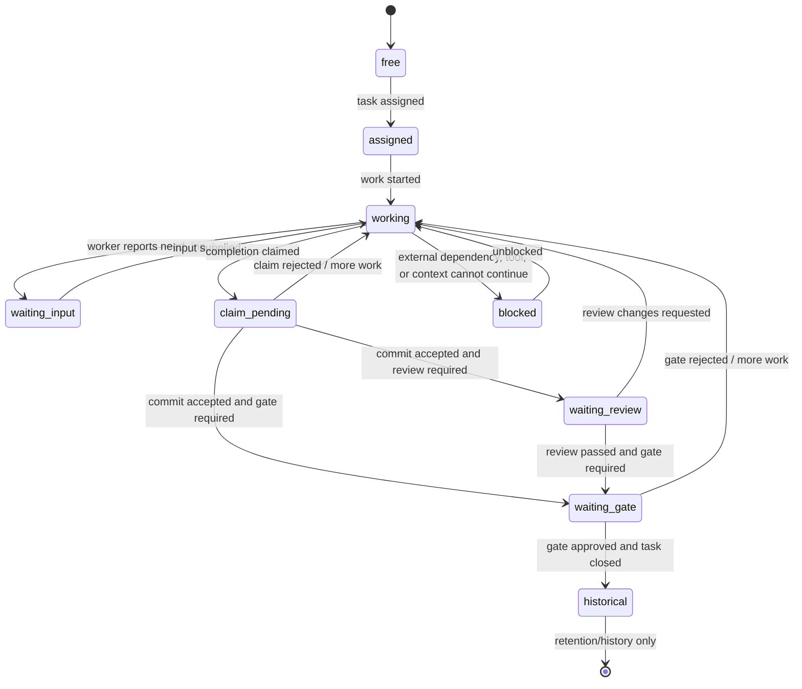

# Runtime State Target State

Date: 2026-06-08

Scope: this document proposes the target runtime, identity, workload, gate relevance, and UI visibility model. It is a design target for review and future implementation. The current implementation is documented separately in [runtime-state-current-state.md](runtime-state-current-state.md).

## Executive Summary

The target model keeps `AgentRuntimeState`, but narrows its authority. `AgentRuntimeState` describes session activity and health only. It must not decide identity lifecycle, session write authority, task responsibility, gate relevance, presence, or default UI visibility by itself.

The root cause in the current design is state-axis collapse: one enum is used as an activity hint, lifecycle signal, stale-health fallback, workload label, and UI filter. The target design separates those concerns into explicit state machines and projection fields:

- `AgentIdentityLifecycle` decides whether an identity is active, dormant, archived, or retired.
- `SessionAuthorityState` decides whether a session has write authority.
- `SessionActivityState` / `AgentRuntimeState` describes what the session is doing and whether it is healthy.
- `PresenceState` describes online, stale, or offline freshness.
- `WorkloadState` describes current task or claim responsibility.
- `InboxRelevanceState` decides whether inbox state still carries deliverable responsibility.
- `GateRelevanceState` decides whether a gate still needs attention.
- `UIVisibilityState` decides where an item appears by default.

This follows patterns from mature orchestration systems: Kubernetes separates object phase, status conditions, and user-facing status display; Airflow models task-instance lifecycle independently from the worker process; Temporal separates append-only event history, mutable state, and visibility projections; Nomad exposes allocation, task state, and recent events instead of one overloaded status field.

## Target Principles

1. `runtime_state` is a session activity/health field, not a lifecycle source of truth.
2. Identity, authority, presence, workload, gate relevance, and UI visibility are orthogonal axes.
3. Every normal transition goes through a named operation with an owner. Generic state mutation is deprecated or admin-only.
4. Durable state preserves audit. Projection-level relevance suppresses stale noise without rewriting history.
5. Freshness policy fails closed: stale active responsibility becomes attention or escalation, not silent archive.
6. UI consumes explicit relevance and visibility projections, not raw enum inference.

## Target Public Contracts

These fields are the target contract shape. Their storage mode is part of the contract because stale projections must not become false durable truth.

| Field | Values | Authority | Storage mode |
| --- | --- | --- | --- |
| `identity_lifecycle` | `active`, `dormant`, `archived`, `retired` | Agent identity roster policy | Durable eventually; projection acceptable for MVP |
| `session_role` | `primary`, `standby`, `replaced`, `quarantined`, `retired` | Session authority policy | Durable |
| `session_end_reason` | `replaced`, `retired`, `expired`, `normal_shutdown`, `user_archived`, `protocol_violation` | Session termination policy | Durable |
| `runtime_state` | Session activity/health states listed below | Runtime state machine | Durable |
| `presence_state` | `online`, `stale`, `offline`, `unknown` | Freshness policy | Projection from heartbeat/session timestamps |
| `workload_state` | `free`, `assigned`, `working`, `waiting_input`, `claim_pending`, `waiting_review`, `waiting_gate`, `blocked`, `historical` | Task/claim/review/gate projection | Projection |
| `inbox_relevance_state` | `deliverable`, `delivered`, `lease_expired`, `revoked`, `reassigned`, `orphaned`, `diagnostics_only` | Inbox relevance projection | Projection first; revoke/reassign can be durable events |
| `gate_relevance_state` | `actionable`, `waiting_evidence`, `waiting_owner`, `superseded`, `historical`, `orphaned`, `diagnostics_only` | Gate relevance projection | Projection |
| `ui_visibility_state` | `main`, `secondary`, `needs_attention`, `approval_center`, `diagnostics`, `history`, `hidden` | UI projection | Projection |
| `conditions` | Runtime condition records | Condition derivation | Projection first; critical transitions may also emit durable events |

Compatibility note: `WAITING_FOR_COMMIT`, `WAITING_FOR_REVIEW`, and `WAITING_FOR_GATE` may remain in the current enum during migration, but they are workload-derived runtime hints. They are not session authority states and not identity lifecycle states.

Presence note: `presence_state` answers only heartbeat freshness and reachability. It must not encode whether the agent has work. Use `presence_state=online` plus `workload_state=free` to produce an "idle" UI label.

Reason fields are strings or narrow enums attached to projections, not new top-level state axes. Target reason fields include `archive_reason`, `hidden_reason`, `relevance_reason`, and `workload_terminal_reason`.

## Runtime Conditions

Conditions explain state without expanding the primary enum vocabulary. Use them for diagnostics, UI tooltips, action reasons, and reconcile decisions.

```text
RuntimeCondition:
  type: string
  status: true | false | unknown
  reason: string
  message: string | null
  severity: info | warning | error | critical
  source: string
  last_transition_at: string
  observed_generation: int | null
```

Recommended condition types:

- Agent/session: `Ready`, `Reachable`, `Schedulable`, `Fenced`, `ContextValid`, `InputAvailable`, `HasActiveWork`, `HasDeliverableInbox`, `ReplacementRecommended`.
- Gate: `EvidenceReady`, `OwnerAvailable`, `ContextValid`, `TaskActive`, `SupersededByNewerGate`.
- Inbox: `Deliverable`, `LeaseValid`, `OwnerAuthoritative`, `Reassigned`, `Revoked`.

Rules:

- Enums express the main state. Conditions express reasons, health facts, and diagnostics.
- Do not create new enum states for every reason such as missing evidence, unavailable owner, expired heartbeat, or invalid context.
- UI labels should be derived from state plus conditions, for example `runtime_state=STANDBY_READY`, `presence_state=online`, `workload_state=free`, `Ready=true`, and `HasActiveWork=false` can render as `Idle`.

## Desired, Effective, And Reconciliation

The target model distinguishes desired authority from effective observed state.

| Layer | Example fields | Meaning |
| --- | --- | --- |
| Desired state | `desired_identity_lifecycle`, `desired_session_role`, `desired_owner_task_id`, `desired_accepts_new_work` | What the system currently wants. |
| Effective state | `identity_lifecycle`, `session_role`, `presence_state`, `runtime_state`, `workload_state`, `ui_visibility_state`, `conditions` | What records and freshness policy currently prove. |

MVP can derive desired/effective state in projections. A durable desired-state table is not required until scheduling or replacement policy needs it.

`RuntimeReconciler` is the policy owner that compares records, freshness, desired state, and projections. Initial implementation can be projection-only through the relevance engine. Durable reconciliation events are appropriate only for irreversible or externally visible changes such as session expiry, inbox revocation/reassignment, explicit archive, or replacement approval.

RuntimeReconciler responsibilities:

- Scan session freshness and derive `presence_state`.
- Escalate stale active responsibility to `SUSPECTED_STUCK` or action items.
- Expire, revoke, or reassign inbox leases.
- Archive stale identities only when no unreassigned responsibility remains.
- Project open gates on terminal or superseded work as historical/superseded.
- Emit action items for owner unavailable, stuck work, expired lease, or replacement-needed cases.

## Agent Identity Lifecycle

This answers: should this agent identity be scheduled, shown in the main roster, or retained only for audit?



| State | Meaning | Default UI |
| --- | --- | --- |
| `active` | Schedulable, visible, can own work. | `main` or `needs_attention` |
| `dormant` | No current healthy primary, but recent enough to recover. | `secondary` or `diagnostics` |
| `archived` | No active session, active task, actionable gate, pending claim, deliverable inbox lease, or unreassigned responsibility past the archive threshold. | `hidden` by default, visible in history |
| `retired` | Permanently removed from scheduling, audit retained. | `history` only |

Rules:

- Stale standby identity with no active responsibility moves toward `archived`, not `STANDBY_DEGRADED` in the main roster.
- Stale worker with active task, actionable gate, pending claim, deliverable inbox lease, or unreassigned responsibility remains actionable or `needs_attention`.
- Ordinary queued inbox does not keep an offline, stale, or replaced identity visible. Only deliverable or responsibility-bearing inbox relevance can block archive.
- Temporary simulation, QA, and controller identities without canonical registration archive when stale and responsibility-free.
- Canonical controller identity can remain diagnosable when stale, but should not appear as normally active.
- Visibility policy must not key off role strings alone. `role=controller` or `role=qa` does not grant main roster visibility without canonical identity and responsibility signals.

Target identity metadata:

| Field | Values | Meaning |
| --- | --- | --- |
| `canonical` | `true`, `false` | Whether this identity is registered as a durable system/user identity. |
| `identity_origin` | `system`, `user_registered`, `runtime_discovered`, `simulation`, `temporary`, `imported` | How the identity entered the roster. |
| `visibility_policy` | `system_critical`, `normal`, `ephemeral`, `hidden_by_default` | Default roster policy before responsibility and freshness are applied. |
| `archive_reason` | `heartbeat_expired_no_responsibility`, `temporary_identity_expired`, `manual_archive`, `run_completed` | Why the identity left default active views. |

## Session Authority State Machine

This answers: can this concrete session write, ack, claim, or commit?



Rules:

- `primary` is the normal write-authority role.
- `standby` may heartbeat and wait, but cannot commit claims unless policy explicitly allows it.
- `quarantined` cannot write business state and requires controller or user action.
- `replaced` is valid only when another session actually takes over the same responsibility.
- Sessions that simply age out use `retired` or `expired` end reason, not false `replaced`.
- Replacement, quarantine, retire, and revocation invalidate old fencing tokens.
- `session_role=replaced` requires `session_end_reason=replaced` and `replaced_by_session_id` to be non-null.
- `session_role=retired` may use `session_end_reason=retired`, `expired`, `normal_shutdown`, `user_archived`, or `protocol_violation`.
- Only one primary session is allowed per `AgentIdentity` authority scope. MVP uses identity-level primary authority; future task-level or run-level authority must introduce an explicit `authority_scope` before allowing multiple primaries.

## Session Activity And Health State Machine

This answers: what is the session doing, and what recovery policy applies?

Primary `AgentRuntimeState` values:

- `STANDBY_READY`
- `WAITING_ON_BUS`
- `WAIT_RETURNED_NOOP`
- `DELIVERED_NOT_ACKED`
- `WORKING`
- `REHYDRATING`
- `STANDBY_DEGRADED`
- `SUSPECTED_STUCK`
- `INPUT_UNAVAILABLE`
- `CONTEXT_LOST`
- `NEEDS_REHYDRATION`



Rules:

- `STANDBY_DEGRADED` means the session is still in scope and health-degraded. It is not the universal state for offline idle agents.
- Offline idle agents are better represented as `runtime_state=STANDBY_READY`, `presence_state=offline`, `workload_state=free`, and `ui_visibility_state=hidden` or `history`.
- `SUSPECTED_STUCK` is reserved for active responsibility with expired lease, heartbeat, or recovery deadline.
- `WAITING_FOR_COMMIT`, `WAITING_FOR_REVIEW`, and `WAITING_FOR_GATE` do not appear in this primary session activity graph.
- `INPUT_UNAVAILABLE` means the agent input/control channel is broken, such as transport loss, CLI control failure, or inability to receive commands. It does not mean the worker is waiting for user or controller information.
- A session cannot enter `WORKING` merely by heartbeat override or generic state update. `start_work` requires active assignment context binding, primary session authority, valid fencing token, task ownership by this agent, and a non-terminal task unless the session is explicitly marked as non-task diagnostics.

Heartbeat allowed effects:

- Refresh `last_seen_at`.
- Refresh or derive `presence_state`.
- Clear `STANDBY_DEGRADED` when there is no active responsibility and the session is healthy again.
- Recover from `SUSPECTED_STUCK` only when the heartbeat carries valid active binding or progress evidence.
- It cannot set `runtime_state=WORKING` without `start_work` or a progress report with valid binding, authority, fencing, and task ownership.

## Workload Responsibility State Machine

This answers: what responsibility does this agent currently carry?



Rules:

- A session can be online and able to receive messages while one of its tasks is `claim_pending`, `waiting_review`, or `waiting_gate`.
- `accepts_new_work`, `max_concurrent_tasks`, active claims, and policy decide whether the agent may receive more work.
- `waiting_input` means the work is waiting for user, controller, or domain input. It is distinct from `INPUT_UNAVAILABLE`, which is a broken session control channel.
- `blocked` is reserved for external dependency, tool, context, or policy blockers that cannot be resolved by simply supplying requested input.
- Claim timeout escalates the claim to controller or QA. It must not silently archive the agent.
- Workload state is derived from task, claim, review, and gate records. It is not a mutable session field.
- Terminal details belong in `workload_terminal_reason`, not in new workload enum values. Suggested reasons are `completed`, `failed`, `cancelled`, `superseded`, and `reassigned`.

## Inbox Relevance State

This answers: does inbox state still carry deliverable responsibility for an agent or session?

Inbox relevance states:

- `deliverable`
- `delivered`
- `lease_expired`
- `revoked`
- `reassigned`
- `orphaned`
- `diagnostics_only`

Rules:

- `deliverable` inbox can block identity archive only when it is still assigned to a valid active or recoverable authority.
- `delivered` inbox with an unexpired ack lease can keep the related workload in attention.
- `lease_expired` inbox must trigger revoke, reassignment, or stuck escalation; it must not keep a stale session visible forever.
- `revoked` and `reassigned` inbox do not preserve visibility for the old session.
- `orphaned` and `diagnostics_only` inbox are retained for audit or debugging only.

Inbox lease fields required for accurate relevance:

| Field | Meaning |
| --- | --- |
| `delivered_to_session_id` | Session that currently owns the delivered item lease. |
| `delivery_epoch` | Session epoch at delivery time; stale epochs invalidate authority. |
| `lease_expires_at` | Ack deadline used to derive `lease_expired`. |
| `owner_authority_valid` | Projection boolean derived from session role, epoch, fencing, and replacement status. |

## Gate State, Relevance, And Visibility

This answers: does a gate still require a human or QA decision?

Durable gate states:

- `open`
- `approved`
- `rejected`
- `escalated`
- `expired`

Target gate fields:

| Field | Values | Meaning |
| --- | --- | --- |
| `gate_kind` | `qa`, `security`, `release`, `human_approval`, `policy` | Gate category used to compare supersession scope. |
| `relevance_reason` | string or narrow enum | Why the projected relevance was chosen. |

Projection-only relevance states:

- `actionable`
- `waiting_evidence`
- `waiting_owner`
- `superseded`
- `historical`
- `orphaned`
- `diagnostics_only`

Visibility states:

- `approval_center`
- `needs_attention`
- `secondary`
- `history`
- `diagnostics`
- `hidden`

Rules:

| Condition | Relevance | Visibility |
| --- | --- | --- |
| `open` or `escalated` + active task + valid context + evidence ready + owner available | `actionable` | `approval_center` |
| `open` or `escalated` + active task + valid context + evidence ready + owner unavailable | `waiting_owner` | `needs_attention` |
| `open` + active task + missing required evidence | `waiting_evidence` | `secondary` |
| `open` + completed task | `historical` | `history` |
| `open` + superseded task | `superseded` | `history` |
| `open` + invalidated context | `superseded` | `history` |
| `open` + newer gate for same task and `gate_kind` | `superseded` | `history` |
| `open` + terminal run | `historical` | `history` |
| Gate references missing task/run after retention | `orphaned` | `diagnostics` |

Do not mutate durable `gate.state` to `superseded`. Supersession is projection-level relevance so audit history remains intact.

`waiting_owner` is for gates that are still valid but cannot be decided by the current owner because the decision actor is stale, offline, replaced, retired, or unauthorized. The gate should remain visible as attention, with a reason such as `decision_owner_unavailable`, so controller or QA can reassign it.

## Transition Owners

Every normal transition must go through a named operation. Generic mutation of `runtime_state` is deprecated and should be admin-only with audit reason.

| Operation | Writer / owner | State axis affected |
| --- | --- | --- |
| `start_session` | AgentDirectory / ProtocolKernel | identity, authority, activity, presence |
| `heartbeat` | Worker session API | activity, presence |
| `wait_start` | Inbox worker API | activity |
| `deliver_item` | InboxStore through ProtocolKernel | activity, workload |
| `ack_item` | Fenced worker inbox ack | activity, workload |
| `expire_inbox_lease` | Inbox lease policy worker | inbox relevance, activity |
| `reassign_inbox` | Controller/InBox policy through ProtocolKernel | inbox relevance, workload |
| `start_work` | TaskBoard through ProtocolKernel | activity, workload |
| `claim_completion` | Worker claim API | workload |
| `commit_claim` | Controller API | workload |
| `request_review` | Controller/review service | workload |
| `open_gate` | Controller/Gate service | durable gate, gate relevance |
| `decide_gate` | Controller/user/authorized QA | durable gate, workload, gate relevance |
| `freshness_tick` | RuntimeStateMachine policy worker | presence, activity, identity visibility |
| `reconcile_runtime` | RuntimeReconciler / RelevanceEngine | presence, relevance, visibility, conditions, action items |
| `approve_replacement` | ReplacementCoordinator through ProtocolKernel | authority, activity, workload, inbox |
| `retire_session` | Controller/user cleanup policy | authority, identity lifecycle |
| `archive_identity` | Roster cleanup policy | identity lifecycle, UI visibility |
| `admin_update_session_state` | Admin-only break-glass path | activity with required audit reason |

## Freshness And Visibility Policy

Freshness derives `presence_state` first, then activity escalation and visibility. It should not directly overload `runtime_state` for every stale case.

| Situation | Target projection |
| --- | --- |
| Fresh primary session with no work | `presence_state=online`, `workload_state=free`, `ui_visibility_state=main` |
| Stale standby with no responsibility | `presence_state=offline`, `identity_lifecycle=archived`, `ui_visibility_state=hidden` |
| Stale worker with active task | `runtime_state=SUSPECTED_STUCK`, `workload_state` unchanged, `ui_visibility_state=needs_attention` |
| Stale delivered item without ack | `runtime_state=SUSPECTED_STUCK`, revoke or reassign lease |
| Stale `REHYDRATING` | `runtime_state=SUSPECTED_STUCK`, replacement escalation |
| Replaced session with queued inbox | queued inbox revoked or reassigned; queued inbox does not keep replaced session visible |
| Gate owner unavailable but gate still valid | `gate_relevance_state=waiting_owner`, `ui_visibility_state=needs_attention` |
| Canonical controller stale | diagnostics or needs attention only, not normal active group |

## Implementation Boundaries

- Runtime state machine code owns session activity and health transitions.
- Identity roster policy owns identity lifecycle and archive rules.
- Authority/fencing policy owns session write authority.
- Inbox relevance owns deliverable, expired, revoked, reassigned, and orphaned inbox visibility.
- Task, claim, review, and gate services own workload state inputs.
- Gate relevance is a projection over durable gate, task, run, context, and evidence records.
- UI visibility is a projection output consumed by frontend pages.
- Frontend components must not solve protocol, authority, stale-health, or gate relevance decisions locally.

## Acceptance Criteria For Future Implementation

1. Stale standby agent without active task is archived from the main roster.
2. Stale worker with active task remains visible in `needs_attention`.
3. Stale temporary QA/controller without canonical flag is archived.
4. Stale canonical controller is visible only in diagnostics or attention, not the normal active group.
5. Open gate on completed task projects as historical relevance.
6. Open gate on superseded task projects as superseded relevance.
7. Open gate with invalidated context projects as superseded relevance.
8. Queued inbox for replaced session is revoked or reassigned and does not keep the session visible.
9. `DELIVERED_NOT_ACKED` lease expiry moves activity to `SUSPECTED_STUCK`.
10. `REHYDRATING` timeout moves activity to `SUSPECTED_STUCK`.
11. Claim timeout escalates the claim and does not silently archive the agent.
12. Invalid `update_session_state` transition fails unless an admin override with audit reason is used.
13. Event replay can rebuild activity, workload, gate relevance, and visibility projections.
14. UI approval center contains only actionable or waiting-evidence gates by default.
15. Historical, superseded, orphaned, and diagnostics-only gates remain inspectable outside the approval center.
16. `role=controller` or `role=qa` alone does not grant main roster visibility.
17. Given `role=controller`, `canonical=false`, and `identity_origin=simulation`, a stale identity with no active responsibility archives and does not appear in visible agents.
18. `presence_state=online` plus `workload_state=free` renders as an idle label without introducing `presence_state=idle`.
19. `INPUT_UNAVAILABLE` is used only for broken input/control channel cases; user/controller information waits use `workload_state=waiting_input`.
20. Gate with valid task/context/evidence but unavailable decision owner projects as `waiting_owner` and `needs_attention`.
21. `session_role=replaced` is rejected unless `session_end_reason=replaced` and `replaced_by_session_id` are present.
22. Projection output includes conditions with stable `type`, `status`, `reason`, `severity`, `source`, and `last_transition_at`.
23. `presence_state`, `workload_state`, `gate_relevance_state`, and `ui_visibility_state` are derived projections, not independently persisted truth.
24. Only one identity-level primary session can exist unless an explicit `authority_scope` is introduced.
25. Heartbeat refreshes presence but cannot unilaterally move a session into `WORKING`.
26. Inbox relevance uses `delivered_to_session_id`, `delivery_epoch`, `lease_expires_at`, and derived `owner_authority_valid`.
27. Gate supersession compares newer gates by the same task and `gate_kind`.
28. RuntimeReconciler or RelevanceEngine, not frontend components, computes freshness, archive eligibility, inbox lease expiry, gate relevance, and action items.

## References

- Kubernetes Pod lifecycle: separates Pod phase, conditions, and display status. See <https://kubernetes.io/docs/concepts/workloads/pods/pod-lifecycle/>.
- Kubernetes Deployment conditions: reports progress deadline failures as conditions without automatically deciding the higher-level action. See <https://kubernetes.io/docs/concepts/workloads/controllers/deployment/>.
- Apache Airflow task instances: models task-instance lifecycle states independently from worker process status. See <https://airflow.apache.org/docs/apache-airflow/stable/core-concepts/tasks.html>.
- Temporal History Service: separates event history, mutable state, background tasks, and visibility updates. See <https://github.com/temporalio/temporal/blob/main/docs/architecture/history-service.md>.
- HashiCorp Nomad allocation inspection: exposes allocation status, task state, and recent events as separate diagnostic signals. See <https://developer.hashicorp.com/nomad/docs/job-run/inspect>.
- Prefect states: separates orchestration state type from state name and message-style explanation. See <https://docs.prefect.io/v3/concepts/states>.

## Implementation Notes

The implementation is staged through Wave10:

- Contract fields are added first so durable records and projection outputs have explicit axes before UI consumption changes.
- Runtime freshness and presence policy are projection-owned; stale reads do not rewrite durable session activity as false lifecycle truth.
- Inbox and gate relevance are projection-owned; deliverability, owner authority, missing evidence, supersession, and historical visibility are derived from durable facts.
- Frontend consumes explicit visibility fields and does not infer protocol state from role strings, raw `runtime_state`, stale health, or local gate/inbox rules.
